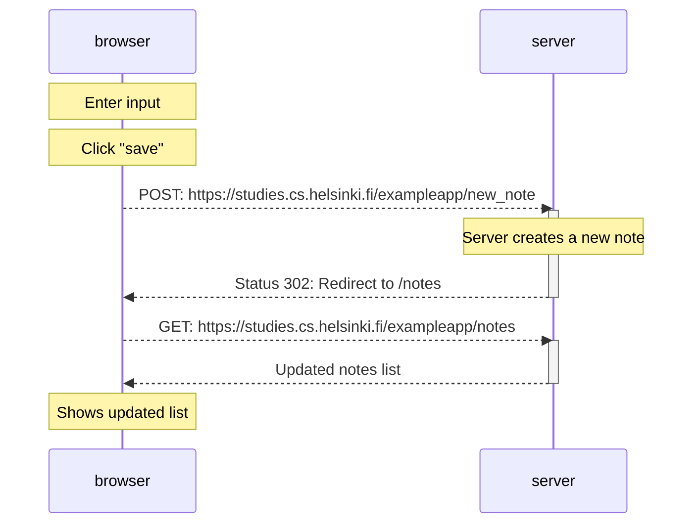

```mermaid
  sequenceDiagram
    participant browser
    participant server

    Note over browser: Enter input
    Note over browser: Click "save"
    browser-->>server: POST: https://studies.cs.helsinki.fi/exampleapp/new_note

    activate server
    Note over server: Server creates a new note
    server-->>browser: Status 302: Redirect to /notes
    
    deactivate server
    browser-->>server: GET: https://studies.cs.helsinki.fi/exampleapp/notes

    activate server
    server-->>browser: Updated notes list
    deactivate server

    Note over browser: Shows updated list
```
