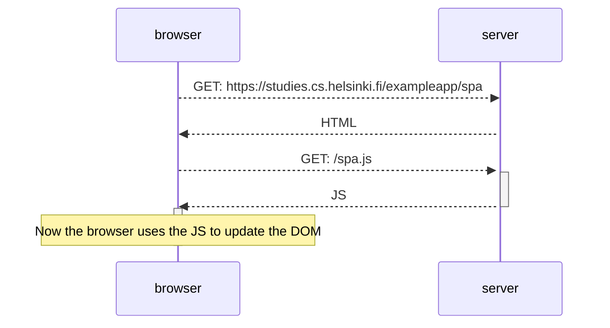

```mermaid
  sequenceDiagram
    participant browser
    participant server

    browser-->>server: GET: https://studies.cs.helsinki.fi/exampleapp/spa
    activate server
    server-->>browser: HTML
    browser-->>server: GET: /spa.js
    activate server
    server-->>browser: JS
    deactivate server

    activate browser
    Note over browser: Now the browser uses the JS to update the DOM
    deactivate browser
```